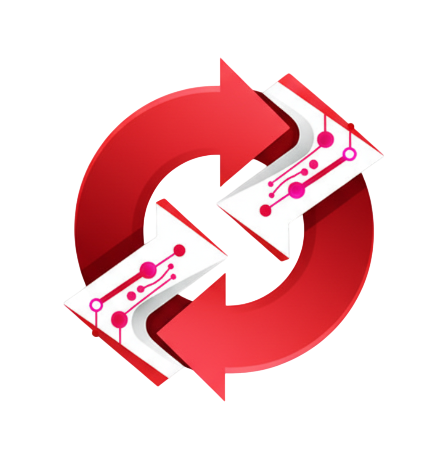

# AI Dev Suite



**Sua suíte de desenvolvimento local centralizada e potencializada por IA para acelerar a criação, análise e gerenciamento de projetos Node.js e React.**

O **AI Dev Suite** é uma ferramenta full-stack projetada para desenvolvedores que utilizam modelos de linguagem (LLMs) em seu fluxo de trabalho. Ele age como uma ponte entre a geração de código por IA e seu ambiente de desenvolvimento local, automatizando tarefas repetitivas e fornecendo insights valiosos sobre suas aplicações.

## Benefícios e Filosofia

Em um fluxo de trabalho moderno com IA, muitas tarefas ainda são manuais: copiar e colar código, analisar estruturas de projeto para fornecer contexto à IA, gerenciar prompts, etc. O **AI Dev Suite** foi criado para resolver esses problemas, oferecendo uma interface unificada para:

- **Analisar Projetos:** Gere uma representação completa do seu projeto (estrutura de diretórios e conteúdo de arquivos) em um único arquivo de texto, pronto para ser usado como contexto para uma LLM.
- **Escrever Código:** Receba o código gerado pela IA (com a notação `[FILEPATH:...]`) e materialize os arquivos e diretórios automaticamente no seu projeto local.
- **Gerenciar Versionamento:** Realize commits e reverta alterações com um clique, simplificando o controle de versão após a geração de código.
- **Construir Projetos:** Crie novas estruturas de projeto a partir de templates pré-definidos (backend e frontend) de forma rápida e consistente.
- **Manter uma Biblioteca de Prompts:** Organize e reutilize seus prompts mais eficazes em uma biblioteca centralizada.
- **E muito mais!**

## Principais Funcionalidades

- **Project Analyzer:** Analisa um diretório local e gera uma representação textual completa do projeto, incluindo a árvore de diretórios e o conteúdo de cada arquivo, ideal para fornecer contexto a LLMs.
- **Code Writer:** Interpreta uma entrada de texto contendo blocos `[FILEPATH:...]` e cria/sobrescreve os arquivos correspondentes no diretório do projeto selecionado.
- **Git Management:** Interface simplificada para inicializar repositórios, adicionar todos os arquivos e realizar commits com uma mensagem, ou reverter todas as alterações não commitadas (`git reset --hard` e `git clean -fd`).
- **Project Builder:** Um assistente passo a passo para criar novos projetos, definindo um diretório raiz e adicionando sub-projetos (como backend e frontend) a partir de templates customizáveis.
- **Prompt Library:** Um CRUD completo para organizar seus prompts em categorias, facilitando a reutilização e o refinamento.
- **Project Metrics:** Calcula métricas úteis como a contagem de linhas e a estimativa de tokens de um projeto, ajudando a entender a complexidade e o custo potencial de interações com APIs de LLMs.
- **Favicon Generator:** Gere todos os favicons necessários (`favicon.ico`, `apple-touch-icon.png`, etc.) e os arquivos de configuração (`manifest.json`, `browserconfig.xml`) a partir de uma única imagem, atualizando automaticamente o `index.html` do seu projeto frontend (compatível com Vite e Create React App).
- **Go Dev:** Uma ferramenta auxiliar para gerar rapidamente um prompt de contexto para a LLM com base no projeto ativo.
- **Integração com o Ambiente Local:** Abra qualquer projeto gerenciado diretamente no VS Code ou no explorador de arquivos do seu sistema operacional.

## Tech Stack

- **Backend:**
  - Node.js
  - Express.js
  - JSON como banco de dados (para simplicidade)
  - simple-git, fs-extra, sharp
- **Frontend:**
  - React
  - Vite
  - Material-UI (MUI)
  - Axios

## Começando

Siga os passos abaixo para instalar e executar o AI Dev Suite em sua máquina local.

### Pré-requisitos

- Node.js (v18 ou superior)
- npm (ou yarn/pnpm)

### Instalação

Os scripts de instalação automatizam a instalação das dependências para o backend e o frontend, além de realizar o build da aplicação React.

**No Windows:**

```bash
install.bat
```

**No macOS/Linux:**

```bash
chmod +x install.sh
./install.sh
```

### Executando o Projeto

Os scripts de inicialização utilizam o `concurrently` para iniciar o servidor backend e o servidor frontend simultaneamente. O frontend será servido a partir da pasta `dist` (build de produção).

**No Windows:**

```bash
run.bat
```

**No macOS/Linux:**

```bash
chmod +x run.sh
./run.sh
```

Após executar o script:

- O **Backend** estará rodando em `http://localhost:5858`.
- O **Frontend** estará acessível em `http://localhost:5859`.

Seu navegador padrão será aberto automaticamente na página da aplicação.

## Como Usar

1.  **Gerencie seus Projetos:** Acesse a página "Project Management" (no menu superior esquerdo) e cadastre os diretórios dos seus projetos locais. Você pode criar projetos raiz e associar sub-projetos a eles.
2.  **Selecione um Projeto Ativo:** Use o seletor de projetos no topo da página para definir o contexto de trabalho.
3.  **Analise:** Na página "Analyzer", selecione o projeto ativo e clique em "Analisar". O conteúdo será exibido e você poderá copiar ou baixar o resultado para usar em sua LLM.
4.  **Escreva Código:** Na página "Code Writer", cole a resposta da sua LLM (contendo os blocos `[FILEPATH:...]`) e clique em "Gerar Arquivos". A ferramenta criará a estrutura no seu diretório local.
5.  **Faça um Commit:** Após gerar o código, vá para a página "Git", adicione uma mensagem de commit (ou use a padrão) e salve seu progresso.

## Licença

Este projeto é distribuído sob a Licença MIT. Veja o arquivo `LICENSE` para mais detalhes.
